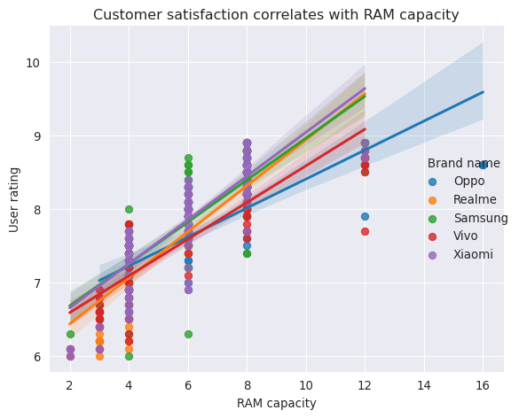

# Top 10 things I learned from the book Effective Pandas by Matt
Harrison

[Effective Pandas by Matt
Harrison](https://store.metasnake.com/effective-pandas-book) is a guide
to the Pandas library, a powerful Python tool for data manipulation and
analysis. The book covers a wide range of topics, from basic data
structures to advanced techniques for data cleaning, transformation, and
visualization.

I have found Effective Pandas to be a captivating and thought-provoking
read. The book offers a genuinely unique take on data wrangling, putting
a great emphasis on the utility of *chaining methods* and utilizing the
*lambda function*. I have found these ideas to be so useful and
practical that I have revisited the book multiple times just to make
sure I keep them fresh in my memory. I must have read the book from back
to back at least 3-4 times.

In this article, I will share the top 10 (+1) things I learned from
Effective Pandas. These are the concepts and techniques that I found to
be the most useful and practical.

We will use the [Real World Smartphone’s
Dataset](https://www.kaggle.com/datasets/abhijitdahatonde/real-world-smartphones-dataset?select=smartphones.csv)
by Abhijit Dahatonde from Kaggle. Let’s get to it.

``` python
import pandas as pd
import numpy as np
import matplotlib.pyplot as plt
import seaborn as sns
pd.set_option('display.max_columns', None)
```

# My Table of content

- [Section 1](#id-section1)

\#
<div id='id-section1'/>

Load the dataset

``` python
df=pd.read_csv('smartphones.csv')
# some info about the dataframe, such as dimensions and dtypes of columns
df.info()
```

    <class 'pandas.core.frame.DataFrame'>
    RangeIndex: 980 entries, 0 to 979
    Data columns (total 22 columns):
     #   Column                     Non-Null Count  Dtype  
    ---  ------                     --------------  -----  
     0   brand_name                 980 non-null    object 
     1   model                      980 non-null    object 
     2   price                      980 non-null    int64  
     3   avg_rating                 879 non-null    float64
     4   5G_or_not                  980 non-null    int64  
     5   processor_brand            960 non-null    object 
     6   num_cores                  974 non-null    float64
     7   processor_speed            938 non-null    float64
     8   battery_capacity           969 non-null    float64
     9   fast_charging_available    980 non-null    int64  
     10  fast_charging              769 non-null    float64
     11  ram_capacity               980 non-null    int64  
     12  internal_memory            980 non-null    int64  
     13  screen_size                980 non-null    float64
     14  refresh_rate               980 non-null    int64  
     15  num_rear_cameras           980 non-null    int64  
     16  os                         966 non-null    object 
     17  primary_camera_rear        980 non-null    float64
     18  primary_camera_front       975 non-null    float64
     19  extended_memory_available  980 non-null    int64  
     20  resolution_height          980 non-null    int64  
     21  resolution_width           980 non-null    int64  
    dtypes: float64(8), int64(10), object(4)
    memory usage: 168.6+ KB

# Tip \#1: Use <code>pd.assign</code> more extensively

The <code>pd.assign</code> method in Pandas is a very powerful tool that
can be used to create new columns, modify existing columns, or both. It
is a very versatile method that can be used in a variety of ways.

One of the most important benefits of using the assign method is that it
can be incorporated into method chaining. This means that you can chain
multiple assign methods together to create a more concise and readable
code. Another benefit of using the assign method is that it completely
sidesteps the infamous <code>SettingWithCopyWarning</code>. This warning
is often triggered when you try to modify an existing column in a
DataFrame. However, the assign method creates a new DataFrame, so there
is no need to worry about this warning.

**Problem statement:** Let’s say we would like to capitalize the brand
names located in the <code>brand_name column</code> as well as calculate
the Pixels Per Inch (PPI). PPI can be calculated following the equation
described by the [Pixel
density](https://en.wikipedia.org/wiki/Pixel_density) page on Wikipedia.

``` python
(df
 .assign(brand_name=lambda df: df.brand_name.str.capitalize(), # capitalizes the brand names 
         PPI=lambda df: (np.sqrt(np.square(df.resolution_height) + np.square(df.resolution_width))
                         .div(df.screen_size)
                         .round(1)
                        )
        )
 .loc[:, ['brand_name','model','PPI']]
 .sort_values(by='PPI',ascending=False)
 .head(5)
)
```

<div>
<style scoped>
    .dataframe tbody tr th:only-of-type {
        vertical-align: middle;
    }
&#10;    .dataframe tbody tr th {
        vertical-align: top;
    }
&#10;    .dataframe thead th {
        text-align: right;
    }
</style>

|     | brand_name | model                               | PPI   |
|-----|------------|-------------------------------------|-------|
| 689 | Sony       | Sony Xperia 1 IV (12GB RAM + 512GB) | 642.6 |
| 696 | Sony       | Sony Xperia Pro-I                   | 642.6 |
| 688 | Sony       | Sony Xperia 1 II                    | 642.6 |
| 655 | Samsung    | Samsung Galaxy S20                  | 566.0 |
| 656 | Samsung    | Samsung Galaxy S20 5G               | 566.0 |

</div>

# Tip \#2: Simplify the management of multiple if-else conditions using <code>np.select</code>

If our goal is to incorporate if-else logic seamlessly into our code, we
can effortlessly achieve this using either <code>pd.mask</code> or
<code>pd.where</code>. Yet, what approach should we adopt when we need
to evaluate multiple conditions instead of just two? In such situations,
we have two options: we can either employ successive
<code>pd.mask</code> or <code>pd.where</code> calls, or we can take
advantage of the <code>np.select</code> function as an alternative
solution.

**Problem statement:** We want to identify the top 3 and top 5 most
popular processor brands in smartphones. To do this, we will first
create two lists, one for the top 3 brands and one for the top 5 brands.
Any processor brand that is not in either of these lists will be
categorized as “Other”.

``` python
# Let's create the two lists that contain the top3 and top5 brand names
top3=df.processor_brand.value_counts().head(3).index
top5=df.processor_brand.value_counts().head(5).index
print(f'Top 3 most popular processors: {top3.tolist()}')
print(f'Top 5 most popular processors: {top5.tolist()}')
```

    Top 3 most popular processors: ['snapdragon', 'helio', 'dimensity']
    Top 5 most popular processors: ['snapdragon', 'helio', 'dimensity', 'exynos', 'bionic']

``` python
'''
Here's an example that employs two successive pd.where calls:
In the first pd.where call, it checks whether the brand is in the top 3; if not, it assigns the label "Top5" to it.
Then, in the second call, it checks if the value is in the top 5; if not, it appends the category "Other".
As you can see, the logic can become intricate and difficult to grasp, especially when dealing with numerous conditions, 
making the code cumbersome and hard to manage.
'''
(df
 .assign(frequency=lambda df: df.processor_brand
         .where(df.processor_brand.isin(top3), other = 'Top5')
         .where(df.processor_brand.isin(top5), other = 'Other')
        )
 .loc[:, 'frequency']
 .value_counts()
)
```

    snapdragon    413
    helio         201
    dimensity     177
    Top5           95
    Other          94
    Name: frequency, dtype: int64

``` python
'''
 Now Let's see np.select!
 It simplifies the process significantly. By providing a list of conditions we want to evaluate and their 
 corresponding values if the condition evaluates to True, we can handle multiple conditions effortlessly. 
 Additionally, we can specify a default value if none of the conditions evaluates to True, making the code 
 much more straightforward and easier to manage. 
'''
(df
 .assign(frequency=lambda df: np.select(condlist=[df.processor_brand.isin(top3), df.processor_brand.isin(top5)],
                                        choicelist=[df.processor_brand,'Top5'],
                                        default='Other'
                                       )
        )
 .loc[:, 'frequency']
 .value_counts()
)
```

    snapdragon    413
    helio         201
    dimensity     177
    Top5           95
    Other          94
    Name: frequency, dtype: int64

# Tip \#3 Filter rows or columns with the combination of <code>pd.loc</code> and <code>lambda</code>

Some experienced Pandas users might consider the following concept
trivial, but it was an eye-opener for me after reading the book. It
turns out that combining <code>pd.loc</code> and <code>lambda</code> (or
any custom functions) allows us to filter both rows and columns,
depending on our specific needs.

**Problem statement:** We are interested in identifying phones with a
battery capacity greater than 5000mAh.

``` python
(df
 .loc[lambda df: df.battery_capacity.gt(5000),['model', 'battery_capacity']] # here we use pd.gt() to select values greater than 5000
 .sort_values(by='battery_capacity')
)
```

<div>
<style scoped>
    .dataframe tbody tr th:only-of-type {
        vertical-align: middle;
    }
&#10;    .dataframe tbody tr th {
        vertical-align: top;
    }
&#10;    .dataframe thead th {
        text-align: right;
    }
</style>

|     | model                                       | battery_capacity |
|-----|---------------------------------------------|------------------|
| 70  | Google Pixel 6 Pro (12GB RAM + 256GB)       | 5003.0           |
| 69  | Google Pixel 6 Pro                          | 5003.0           |
| 977 | Xiaomi Redmi Note 9 Pro Max                 | 5020.0           |
| 922 | Xiaomi Redmi Note 10 Lite                   | 5020.0           |
| 923 | Xiaomi Redmi Note 10 Lite (4GB RAM + 128GB) | 5020.0           |
| ... | ...                                         | ...              |
| 624 | Samsung Galaxy F63                          | 7000.0           |
| 411 | Oukitel WP9                                 | 8000.0           |
| 410 | Oukitel WP21                                | 9800.0           |
| 409 | Oukitel WP19                                | 21000.0          |
| 58  | Doogee V Max                                | 22000.0          |

<p>113 rows × 2 columns</p>
</div>

# Tip \#4 Rename multiple columns effortlessly with <code>rename</code> and <code>replace</code>

OK. This is a big one for me. I used this one multiple times already.
The title pretty much says it all. Let’s say our column names contain
spaces, which makes column selection by attribute access pretty much
impossible. Now, what do we do? Well…Let’s see.

**Problem statement:** We would like to remove all the underscores from
our column names.

``` python
df.columns # original column names for reference
```

    Index(['brand_name', 'model', 'price', 'avg_rating', '5G_or_not',
           'processor_brand', 'num_cores', 'processor_speed', 'battery_capacity',
           'fast_charging_available', 'fast_charging', 'ram_capacity',
           'internal_memory', 'screen_size', 'refresh_rate', 'num_rear_cameras',
           'os', 'primary_camera_rear', 'primary_camera_front',
           'extended_memory_available', 'resolution_height', 'resolution_width'],
          dtype='object')

``` python
# column names after replacing underscores
(df
 .rename(columns = lambda x: x.replace('_', ''))
 .columns
)
```

    Index(['brandname', 'model', 'price', 'avgrating', '5Gornot', 'processorbrand',
           'numcores', 'processorspeed', 'batterycapacity',
           'fastchargingavailable', 'fastcharging', 'ramcapacity',
           'internalmemory', 'screensize', 'refreshrate', 'numrearcameras', 'os',
           'primarycamerarear', 'primarycamerafront', 'extendedmemoryavailable',
           'resolutionheight', 'resolutionwidth'],
          dtype='object')

# Tip \#5: Use <code>pd.clip</code> to easily remove outliers

``` python
# First, we'll identify the phone brands with the most number of handsets present in our dataset."
top10_brand_names = (df
                     .brand_name
                     .value_counts()
                     .head(10)
                     .index
                     .tolist()
                    )
print(top10_brand_names)

# Then we will sort them based on median price
top10_brand_names_ordered = (df
                             .loc[lambda x: x.brand_name.isin(top10_brand_names),['brand_name', 'price']]
                             .groupby('brand_name')
                             .median()
                             .sort_values(by='price')
                             .index
                             .to_list()
                            )
print(top10_brand_names_ordered)
```

    ['xiaomi', 'samsung', 'vivo', 'realme', 'oppo', 'motorola', 'apple', 'oneplus', 'poco', 'tecno']
    ['tecno', 'poco', 'realme', 'xiaomi', 'motorola', 'vivo', 'oppo', 'samsung', 'oneplus', 'apple']

``` python
fig, axs = plt.subplots(1,2, figsize=(12,8))

# For reference, this is what our box plot looks if we leave in the outlier values
(df
 .loc[lambda x: x.brand_name.isin(top10_brand_names),['brand_name', 'price']] # filter rows based on top10_brand_names and select columns
 .pivot(columns='brand_name',values='price') # pivot to get the brand names on the x axis later on
 .loc[:, top10_brand_names_ordered] # order the columns based on median price
 .plot
 .box(title='Top 10 most popular smartphone brands \n -outlier values included-', 
      rot=90,
      ax=axs[0]
     )
)

(df
 .loc[lambda x: x['brand_name'].isin(top10_brand_names), ['brand_name', 'price']]
 .pivot(columns='brand_name', values='price')
 .loc[:, top10_brand_names_ordered]
 .pipe(lambda df: df.assign(**{col : df[col].clip(lower=df[col].quantile(0.05), # this is called dictionary unpacking
                                                  upper=df[col].quantile(0.95))
                              for col in df.columns}))
 .plot
 .box(title='Top 10 most popular smartphone brands \n -only values between 5th and 95th percentiles included-',
      rot=90,
      ax=axs[1]
     )
)
axs[0].set(ylabel='Price in local currency')
plt.tight_layout()
plt.savefig('2023_08_04_EP_1.jpg', dpi=600)
```


# Tip \#6: Find corrupted entries with <code>str.extract</code>

How often have you encountered the situation where, for some reason, a
column that is expected to only contain numerical values displays
<code>object</code> as its <code>dtype</code>? This often indicates the
presence of some string values mixed within the column. It would be
beneficial to promptly identify all the erroneous values, correct them,
and proceed with our analysis smoothly. Let’s explore what we can do in
such scenarios.

**Problem statement:** We would like to identify any cells in a specific
column that contain non-numerical values.

``` python
df_bad_values = df.copy(deep=True) # let's prepare a copy of the original dataframe 

# let's modify some of the values in the price column randomly:
df_bad_values.loc[np.random.randint(0, high=df_bad_values.shape[0], size=10), 'price'] = '.'
df_bad_values.loc[np.random.randint(0, high=df_bad_values.shape[0], size=10), 'price'] = '-'
df_bad_values.loc[np.random.randint(0, high=df_bad_values.shape[0], size=10), 'price'] = '*'
df_bad_values.info() # the modified dataframe's price column now returns object as dtype
```

    <class 'pandas.core.frame.DataFrame'>
    RangeIndex: 980 entries, 0 to 979
    Data columns (total 22 columns):
     #   Column                     Non-Null Count  Dtype  
    ---  ------                     --------------  -----  
     0   brand_name                 980 non-null    object 
     1   model                      980 non-null    object 
     2   price                      980 non-null    object 
     3   avg_rating                 879 non-null    float64
     4   5G_or_not                  980 non-null    int64  
     5   processor_brand            960 non-null    object 
     6   num_cores                  974 non-null    float64
     7   processor_speed            938 non-null    float64
     8   battery_capacity           969 non-null    float64
     9   fast_charging_available    980 non-null    int64  
     10  fast_charging              769 non-null    float64
     11  ram_capacity               980 non-null    int64  
     12  internal_memory            980 non-null    int64  
     13  screen_size                980 non-null    float64
     14  refresh_rate               980 non-null    int64  
     15  num_rear_cameras           980 non-null    int64  
     16  os                         966 non-null    object 
     17  primary_camera_rear        980 non-null    float64
     18  primary_camera_front       975 non-null    float64
     19  extended_memory_available  980 non-null    int64  
     20  resolution_height          980 non-null    int64  
     21  resolution_width           980 non-null    int64  
    dtypes: float64(8), int64(9), object(5)
    memory usage: 168.6+ KB

``` python
# let's find the corrupted values easily:
(df_bad_values
 .price
 .str.extract(r'([^a-zA-Z])') # returns NON-matching alphabetical characters
 .value_counts()
)
```

    *    10
    -    10
    .    10
    dtype: int64

# Tip \#7: Sort values based on the <code>key</code> parameter

The <code>pd.sort_values</code> function surprised me with its
versatility. Previously, I had only used its <code>by</code>,
<code>axis</code>, and <code>ascending</code> parameters for sorting.
However, Matt’s book introduced me to its <code>key</code> parameter,
which allows us to apply any function to sort the values. The only
constraint is that the function must return a <code>Series</code>.

**Problem statement:** For whatever reason, we would like to sort the
phone model names in ascending order based on their second letter.

``` python
(df
 .iloc[:, 1:3]
 .sort_values(by='model',
              key = lambda x: x.str[1],
              ascending = True
             )
 .head(10)
)
```

<div>
<style scoped>
    .dataframe tbody tr th:only-of-type {
        vertical-align: middle;
    }
&#10;    .dataframe tbody tr th {
        vertical-align: top;
    }
&#10;    .dataframe thead th {
        text-align: right;
    }
</style>

|     | model                     | price |
|-----|---------------------------|-------|
| 55  | CAT S22 Flip              | 14999 |
| 697 | TCL Ion X                 | 8990  |
| 195 | LG V60 ThinQ              | 79990 |
| 196 | LG Velvet 5G              | 54999 |
| 197 | LG Wing 5G                | 54999 |
| 108 | iKall Z19 Pro             | 8099  |
| 107 | iKall Z19                 | 7999  |
| 106 | iKall Z18                 | 6799  |
| 54  | BLU F91 5G                | 14990 |
| 413 | POCO C31 (4GB RAM + 64GB) | 7499  |

</div>

# Tip \#8: Reference an existing variable inside <code>pd.query</code> with @

This resembles Tip \#4, as it’s a technique I frequently use. Since
reading Matt’s book, I have started using <code>pd.query</code>
extensively to filter rows based on values, instead of relying on
<code>.loc</code> or <code>.iloc</code>. In case you choose to adopt
<code>pd.query</code> as well, it’s essential to be aware of its
capability to use “@” to reference variables in the environment. This
feature enhances its flexibility and makes it even more convenient to
apply in various data filtering scenarios.

**Problem statement:** Our objective is to identify phones that meet
three specific criteria: being priced below the average market price,
having more processor cores than the average, and possessing a battery
capacity greater than the average.

``` python
average_price=df.price.mean()
average_cores=df.num_cores.mean()
average_battery=df.battery_capacity.mean()

(df
 .query("(price <= @average_price) and (num_cores >= @average_cores) and (battery_capacity >= @average_battery)")
 .iloc[:,:3]
 .sort_values(by='price')
 .head()
)
```

<div>
<style scoped>
    .dataframe tbody tr th:only-of-type {
        vertical-align: middle;
    }
&#10;    .dataframe tbody tr th {
        vertical-align: top;
    }
&#10;    .dataframe thead th {
        text-align: right;
    }
</style>

|     | brand_name | model                          | price |
|-----|------------|--------------------------------|-------|
| 498 | realme     | Realme C30                     | 5299  |
| 179 | itel       | itel Vision 3 (2GB RAM + 32GB) | 5785  |
| 202 | micromax   | Micromax IN 2C                 | 5999  |
| 729 | tecno      | Tecno Spark Go 2022            | 6249  |
| 499 | realme     | Realme C30 (3GB RAM + 32GB)    | 6299  |

</div>

# Tip \#9: Gain more insights by using <code>style.background_gradient</code>

Being a visual creature, I often struggle to comprehend data quickly
just by examining the raw table alone. Fortunately, with the help of
<code>style.background_gradient</code>, similar to the
<code>heatmap</code> function in the <code>seaborn</code> library, we
can represent cells, in terms of color gradient, based on their values.
This enables us to identify trends and patterns in our data swiftly,
making data analysis more intuitive and insightful.

**Problem statement:** Our goal is to identify the overall trends
related to key descriptors found among the Top 10 smartphone brands,
aiming to determine which brand offers the most value for our money.

``` python
(df
 .query("brand_name.isin(@top10_brand_names_ordered)") # filter rows based on top10 brands
 .groupby(['brand_name',])
 [['avg_rating', 'processor_speed', 'ram_capacity', 
   'screen_size', 'battery_capacity', 'price']]
 .mean()
 .sort_values(by='avg_rating')
 .transpose()
 .rename(columns=str.capitalize) # capitalize brand names
 .style
 .set_caption("Key descriptors of the Top 10 smartphone brands")
 .format(precision=1)
 .background_gradient(cmap = 'vlag', axis = 1)
 .set_table_styles([
    {'selector': 'td', 'props': 'text-align: center;'},
     {'selector': 'caption','props': 'font-size:1.5em; font-weight:bold;'}
     ,]
 )
)
```

<style type="text/css">
#T_ecb16 td {
  text-align: center;
}
#T_ecb16 caption {
  font-size: 1.5em;
  font-weight: bold;
}
#T_ecb16_row0_col0, #T_ecb16_row1_col0, #T_ecb16_row2_col2, #T_ecb16_row3_col2, #T_ecb16_row4_col2, #T_ecb16_row5_col0 {
  background-color: #2369bd;
  color: #f1f1f1;
}
#T_ecb16_row0_col1 {
  background-color: #b8c3d5;
  color: #000000;
}
#T_ecb16_row0_col2, #T_ecb16_row2_col7 {
  background-color: #cad0dd;
  color: #000000;
}
#T_ecb16_row0_col3 {
  background-color: #dcdee6;
  color: #000000;
}
#T_ecb16_row0_col4, #T_ecb16_row0_col5 {
  background-color: #efd8d6;
  color: #000000;
}
#T_ecb16_row0_col6 {
  background-color: #eed7d5;
  color: #000000;
}
#T_ecb16_row0_col7 {
  background-color: #edd5d3;
  color: #000000;
}
#T_ecb16_row0_col8, #T_ecb16_row3_col5 {
  background-color: #d39794;
  color: #f1f1f1;
}
#T_ecb16_row0_col9, #T_ecb16_row1_col2, #T_ecb16_row2_col9, #T_ecb16_row3_col0, #T_ecb16_row4_col0, #T_ecb16_row5_col2 {
  background-color: #a9373b;
  color: #f1f1f1;
}
#T_ecb16_row1_col1, #T_ecb16_row5_col3 {
  background-color: #7192c0;
  color: #f1f1f1;
}
#T_ecb16_row1_col3 {
  background-color: #97abc9;
  color: #f1f1f1;
}
#T_ecb16_row1_col4 {
  background-color: #bfc8d8;
  color: #000000;
}
#T_ecb16_row1_col5 {
  background-color: #adbbd1;
  color: #000000;
}
#T_ecb16_row1_col6 {
  background-color: #c0c9d9;
  color: #000000;
}
#T_ecb16_row1_col7 {
  background-color: #bac4d6;
  color: #000000;
}
#T_ecb16_row1_col8 {
  background-color: #bbc5d7;
  color: #000000;
}
#T_ecb16_row1_col9 {
  background-color: #f2e0df;
  color: #000000;
}
#T_ecb16_row2_col0, #T_ecb16_row5_col1 {
  background-color: #3b73bc;
  color: #f1f1f1;
}
#T_ecb16_row2_col1 {
  background-color: #678bbe;
  color: #f1f1f1;
}
#T_ecb16_row2_col3 {
  background-color: #f7f4f4;
  color: #000000;
}
#T_ecb16_row2_col4, #T_ecb16_row5_col5 {
  background-color: #a5b5ce;
  color: #000000;
}
#T_ecb16_row2_col5 {
  background-color: #e2e3ea;
  color: #000000;
}
#T_ecb16_row2_col6, #T_ecb16_row3_col3 {
  background-color: #d49a97;
  color: #f1f1f1;
}
#T_ecb16_row2_col8 {
  background-color: #aab8d0;
  color: #000000;
}
#T_ecb16_row3_col1 {
  background-color: #d9a6a4;
  color: #000000;
}
#T_ecb16_row3_col4, #T_ecb16_row3_col7 {
  background-color: #c47371;
  color: #f1f1f1;
}
#T_ecb16_row3_col6, #T_ecb16_row4_col7 {
  background-color: #cd8885;
  color: #f1f1f1;
}
#T_ecb16_row3_col8 {
  background-color: #cc8784;
  color: #f1f1f1;
}
#T_ecb16_row3_col9 {
  background-color: #c97f7d;
  color: #f1f1f1;
}
#T_ecb16_row4_col1 {
  background-color: #d29491;
  color: #f1f1f1;
}
#T_ecb16_row4_col3 {
  background-color: #e3bfbd;
  color: #000000;
}
#T_ecb16_row4_col4 {
  background-color: #c87c7a;
  color: #f1f1f1;
}
#T_ecb16_row4_col5 {
  background-color: #d1918e;
  color: #f1f1f1;
}
#T_ecb16_row4_col6 {
  background-color: #e7c7c5;
  color: #000000;
}
#T_ecb16_row4_col8 {
  background-color: #d59c99;
  color: #f1f1f1;
}
#T_ecb16_row4_col9 {
  background-color: #deb2b0;
  color: #000000;
}
#T_ecb16_row5_col4 {
  background-color: #4276bc;
  color: #f1f1f1;
}
#T_ecb16_row5_col6 {
  background-color: #809bc3;
  color: #f1f1f1;
}
#T_ecb16_row5_col7 {
  background-color: #7896c1;
  color: #f1f1f1;
}
#T_ecb16_row5_col8 {
  background-color: #6489be;
  color: #f1f1f1;
}
#T_ecb16_row5_col9 {
  background-color: #a0b1cc;
  color: #000000;
}
</style>

| brand_name       | Tecno   | Realme  | Apple   | Vivo    | Poco    | Samsung | Oppo    | Xiaomi  | Motorola | Oneplus |
|------------------|---------|---------|---------|---------|---------|---------|---------|---------|----------|---------|
| avg_rating       | 7.4     | 7.6     | 7.7     | 7.7     | 7.9     | 7.9     | 7.9     | 7.9     | 8.0      | 8.2     |
| processor_speed  | 2.1     | 2.3     | 3.1     | 2.4     | 2.5     | 2.4     | 2.5     | 2.4     | 2.5      | 2.7     |
| ram_capacity     | 5.4     | 5.7     | 5.3     | 6.7     | 6.1     | 6.5     | 7.5     | 6.4     | 6.1      | 8.2     |
| screen_size      | 6.7     | 6.5     | 6.1     | 6.5     | 6.6     | 6.6     | 6.6     | 6.6     | 6.6      | 6.6     |
| battery_capacity | 5333.9  | 4903.1  | 3527.2  | 4703.7  | 5009.4  | 4917.4  | 4667.2  | 4957.6  | 4863.1   | 4759.5  |
| price            | 14545.4 | 17461.4 | 95966.5 | 26782.4 | 18479.2 | 36843.0 | 29650.0 | 27961.1 | 24099.9  | 35858.6 |

Key descriptors of the Top 10 smartphone brands

# Tip \#10: Use <code>pd.pipe</code> to include any functions in our chain

One of the most valuable lessons I learned from Effective Pandas is the
importance of arranging my code in a chain. Although it may feel
somewhat restrictive at first, once you overcome the initial hurdles,
you’ll realize that your code becomes more readable and easier to
understand. The need to invent unique names for temporary variables is
completely eliminated, making coding a much happier experience.

In the chaining world, you often find yourself wanting to use various
functions that are not explicitly designed for chaining. However,
there’s good news! You can still achieve this. The <code>pd.pipe</code>
function comes to the rescue, allowing you to use any function as long
as it returns a Series or DataFrame. It’s a flexible solution that
empowers you to seamlessly integrate different functions into your
chaining workflow, making your data manipulation more efficient and
enjoyable.

**Problem statement:** We aim to visualize the impact of RAM capacity on
user satisfaction. To achieve this, we will utilize the
<code>sns.lmplot</code> function, which plots the data and corresponding
regression models for the Top 5 phone brands.

``` python
top5_brand_names_ordered = df.brand_name.value_counts().head().index

with sns.axes_style("darkgrid"):
    g = (df
         .query("brand_name.isin(@top5_brand_names_ordered)") # filter rows based on top10 brands
         [['brand_name', 'avg_rating', 'ram_capacity']]
         .assign(brand_name=lambda df: df.brand_name.str.capitalize())
         .rename(columns={'brand_name':'Brand name'})
         .pipe(lambda df: sns.lmplot(data=df,
                                     x='ram_capacity',
                                     y='avg_rating',
                                     hue='Brand name',
                                     # height=4,
                                     # aspect=1.2
                                    )
              )
        )

    g.set(title='Customer satisfaction correlates with RAM capacity', 
          xlabel='RAM capacity',
          ylabel='User rating'
         )
plt.tight_layout()
plt.savefig('fig2.jpg', dpi=600)
```



# Tip \#10 + 1: Use the “margin” parameter of <code>pd.crosstab</code> to easily calculate row/column subtotals

Despite primarily using the pandas <code>groupby</code> function for
data aggregation, the <code>pd.crosstab</code> function has an enticing
feature: the <code>margin</code> parameter. This option enables us to
effortlessly calculate subtotals across rows and columns. Moreover, by
normalizing our data, we can gain even more intuition about the
questions we want to answer.

**Problem statement:** Our objective is to evaluate how RAM capacity
impacts user satisfaction across the Top 5 brands. Additionally, we will
normalize our data to compare values comprehensively across the entire
dataset.

``` python
(df
 .query("brand_name.isin(@top5_brand_names_ordered)") # filter rows based on top10 brands
 .assign(brand_name=lambda df: df.brand_name.str.capitalize())
 .pipe(lambda df: pd.crosstab(index=df['ram_capacity'],
                              columns=df['brand_name'],
                              values=df['avg_rating'],
                              aggfunc='mean',
                              margins=True,
                              normalize='all'
                             )
      )
 .mul(100)
 .round(1)
)
```

<div>
<style scoped>
    .dataframe tbody tr th:only-of-type {
        vertical-align: middle;
    }
&#10;    .dataframe tbody tr th {
        vertical-align: top;
    }
&#10;    .dataframe thead th {
        text-align: right;
    }
</style>

| brand_name   | Oppo | Realme | Samsung | Vivo | Xiaomi | All   |
|--------------|------|--------|---------|------|--------|-------|
| ram_capacity |      |        |         |      |        |       |
| 2            | 0.0  | 2.7    | 2.8     | 2.7  | 2.7    | 11.5  |
| 3            | 2.9  | 2.8    | 2.9     | 2.9  | 2.8    | 12.1  |
| 4            | 3.1  | 3.2    | 3.2     | 3.2  | 3.2    | 13.5  |
| 6            | 3.3  | 3.5    | 3.5     | 3.4  | 3.5    | 14.8  |
| 8            | 3.7  | 3.7    | 3.8     | 3.7  | 3.8    | 15.7  |
| 12           | 3.8  | 3.9    | 3.9     | 3.8  | 3.9    | 16.3  |
| 16           | 3.8  | 0.0    | 0.0     | 0.0  | 0.0    | 16.2  |
| All          | 20.2 | 19.6   | 20.2    | 19.8 | 20.2   | 100.0 |

</div>

I hope this article has convinced you to pick up Matt Harrison’s
[Effective Pandas](https://store.metasnake.com/effective-pandas-book)!
There are plenty more exciting ideas in the book beyond the Top 10 I’ve
shared here (I didn’t even get into the fascinating time series part!).
I hope you found these insights helpful and inspiring.

Happy coding 🐼💻🚀
